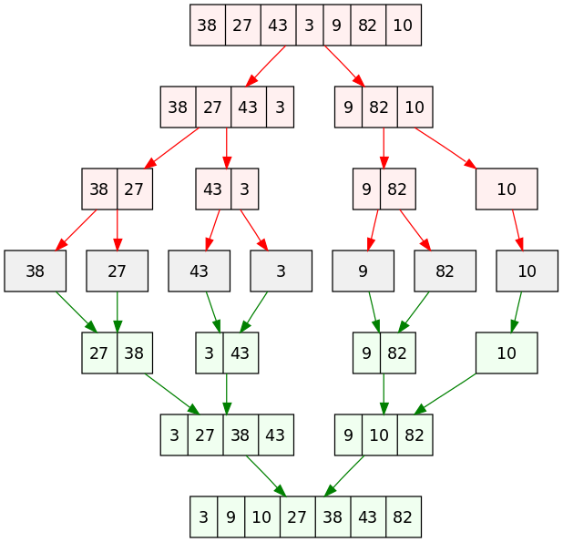

## Software based array sorting in SDK and HLS

### SDK
---
Merge Sort algorithm is implemented as below
* Divide the unsorted list into n sublists, each containing one element.
* Repeatedly merge sublists to produce new sorted sublists until there is only one sublist remaining. This will be the sorted list.

It uses divide and conquer methodology to sort and array. For n elements in a list, the algorithm's average case and worst case performance is in order of O(n log (n) ). There is a overhead of space which can be in order of O(n) in worst case, depending on way of implementation. There are many variant of implementation. The variant can be combination of below listed technique
* Top down
* Bottom up
* Iterative 
* Recusive
* Parallel Multiway

The merge sort solution provided here is Top-Down Recursive variant. The solution list can have maximum of 200 elements. The overhead of space is in O(n) ( i.e 200, maximum number of element)

Time complexity of Merge Sort is `O(n*log(n))`.

Reference:- https://en.wikipedia.org/wiki/Merge_sort

> *Source file is placed in SDK folder*

### HLS
---
Top-Down Recursive variant Merge Sort does not work for vivado HLS. Its difficult to achieve recursive algorithm in hardware implementation.
Top-Down Iterative variant Merge Sort written in C is generated into equivalent hardware block in vivado HLS.

> *Source files and implementation guide is described in HLS folder*
