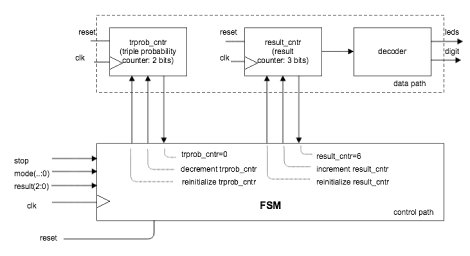
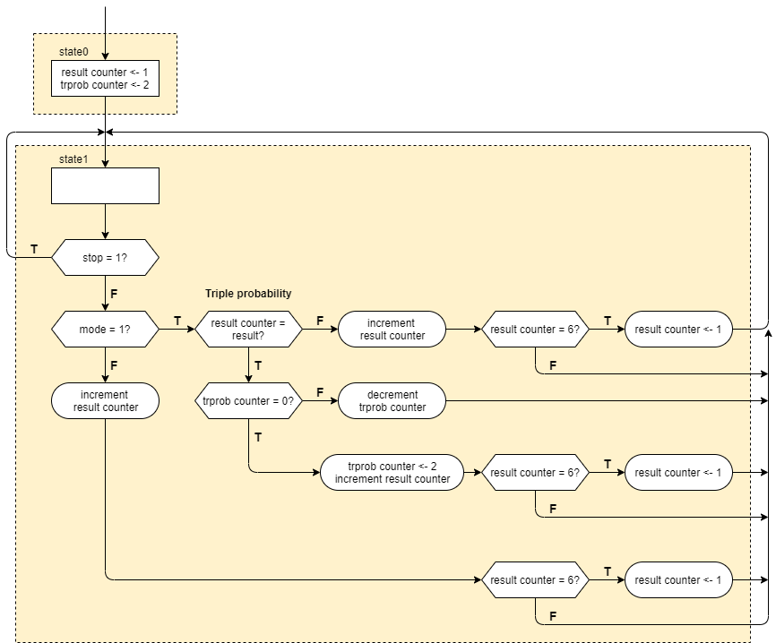
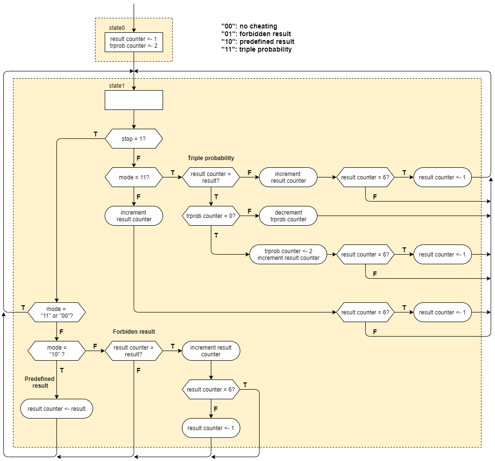

## FSMD-based-e-dice

### ASMD Charts has been done in draw.io

#### The block diagram represented below corresponds to a FSMD architecture that implements the functional requirements of a cheating electronic dice.

---
- The first task is to present an ASMD chart that illustrates the behaviour of presented FSMD illustration above, where there is only two operating modes supported: no cheating, and triple probability for the result specified by the inputs "result(2:0)". That means that "mode" for selecting operating mode is a single input as '0' for no-cheating mode and '1' for triple probability mode. 

#### ASMD Chart for triple probability

---
- The second task is to present an ASMD chart that illustrates the behaviour of presented FSMD illustration above, where there is four operating modes supported: "00": non-cheating, "01": forbidden result, "10": predefined result, "11": triple probability. In forbidden result, predefined result and triple probability the result is specified by the inputs "result(2:0)".

#### ASMD Chart for selected cheating modes

---
- Third task is to build the corresponding VHDL description and prove that the solution works by showing simulation results in Vivado.

##### Following files must be compiled in order to run and simulate FSMD based e-dice solution for triple probability mode:

- FSMD e-dice with triple probability/fsmd_e_dice_triple_probability.vhd
- FSMD e-dice with triple probability/fsmd_e_dice_triple_probability_TB.vhd
- FSMD e-dice with triple probability/fsmd_e_dice_triple_probability_Basys_3_Constrain.xdc

#### Following files must be compiled in order to run and simulate FSMD based e-dice solution for multiple cheating modes:

- FSMD e-dice with modes/fsmd_e_dice_modes.vhd
- FSMD e-dice with modes/fsmd_e_dice_modes_TB.vhd
- FSMD e-dice with modes/fsmd_e_dice_modes_Basys_3_Constrain.xdc